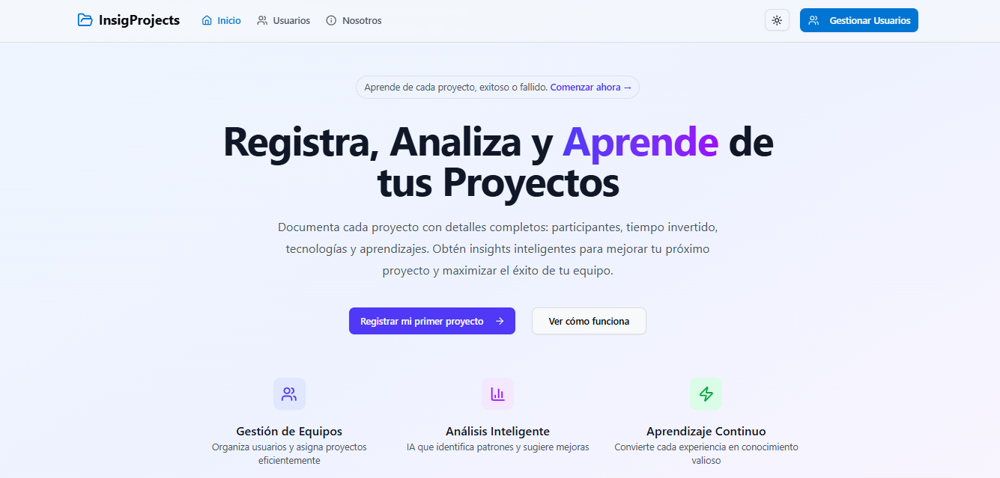

# 📊 Insig Projects

**Convierte cada experiencia en conocimiento valioso y toma decisiones más inteligentes en el futuro.**

---

## 🧠 Descripción general

**Insig Projects** es una plataforma integral para la **documentación inteligente de proyectos**, diseñada para equipos o personas que buscan mejorar continuamente. A través de un sistema robusto y fácil de usar, puedes registrar información completa sobre tus proyectos, incluyendo:

- Participantes
- Tecnologías utilizadas
- Tiempo invertido
- Lecciones aprendidas

Además, la plataforma tiene como objetivo **analizar los datos con IA**, identificar patrones, sugerir mejoras personalizadas y permitir construir una base de conocimiento útil para el futuro. 

---

## 🧩 Características Principales

- ✅ Modo claro y oscuro (intercambiable por el usuario)
- 🧭 Navegación entre 3 páginas principales:
  - `Home`: Página principal con introducción o presentación.
  - `About`: Información sobre la aplicación o el equipo.
  - `Users`: Sección dedicada a la gestión de usuarios y proyectos.

---

## 🗂️ Diccionario de Datos

### 🧑‍💼 Modelo: `User`

| Campo       | Tipo     | Obligatorio | Validaciones                                | Observaciones              |
|-------------|----------|-------------|---------------------------------------------|----------------------------|
| `id`        | Int      | Sí (auto)   | Generado automáticamente                    | Clave primaria             |
| `firstName` | String   | Sí          | Texto, mínimo 3 caracteres                  | Mapeado como `first_name`  |
| `lastName`  | String   | Sí          | Texto, mínimo 6 caracteres                  | Mapeado como `last_name`   |
| `email`     | String   | Sí          | Email válido, único                         |                            |
| `createdAt` | DateTime | No (auto)   | Se asigna automáticamente                   | Mapeado como `created_at`  |
| `projects`  | Project[]| No          | -                                           | Relación uno-a-muchos      |

---

### 📁 Modelo: `Project`

| Campo           | Tipo      | Obligatorio | Validaciones                                                | Observaciones                   |
|------------------|-----------|-------------|-------------------------------------------------------------|---------------------------------|
| `id`             | String    | Sí (auto)   | UUID generado automáticamente                               | Clave primaria                  |
| `title`          | String    | Sí          | Texto no vacío                                              |                                 |
| `status`         | Enum      | Sí          | Valor válido: `SUCCESS` o `FAILURE`                         | Definido en enum `Status`       |
| `startDate`      | DateTime  | Sí          | Formato `YYYY-MM-DD`                                       | Mapeado como `start_date`       |
| `endDate`        | DateTime  | Sí          | Formato `YYYY-MM-DD`                                       | Mapeado como `end_date`         |
| `timeSpentHours` | Float     | Sí          | Número decimal positivo                                     | Mapeado como `time_spent_hours` |
| `teamSize`       | Int       | Sí          | Entero ≥ 1                                                  | Mapeado como `team_size`        |
| `techStack`      | String[]  | Sí          | Array con al menos un elemento                             | Mapeado como `tech_stack`       |
| `reason`         | String    | Sí          | Texto no vacío                                              |                                 |
| `learnings`      | String    | Sí          | Texto no vacío                                              |                                 |
| `createdAt`      | DateTime  | No (auto)   | Se asigna automáticamente                                   | Mapeado como `created_at`       |
| `userId`         | Int       | Sí          | Entero positivo                                             | Relación con `User.id`          |

---

### 🎯 Enum: `Status`

| Valor     | Descripción         |
|-----------|---------------------|
| `SUCCESS` | Proyecto exitoso    |
| `FAILURE` | Proyecto fallido    |

---

## 📋 Requerimientos Funcionales

### 👥 Usuarios

- 🔍 **Buscar usuarios** por nombre o correo electrónico.
- 📄 **Listar usuarios** con soporte de paginación.
- ➕ **Crear un nuevo usuario** mediante un formulario validado.
- 🗑️ **Eliminar usuarios** desde la tabla.
- 👁️ **Ver detalles del usuario** (perfil completo).
- 📝 **Editar información de un usuario existente**.

### 📁 Proyectos por Usuario

- ➕ **Crear proyectos** asociados a un usuario específico.
- 🗑️ **Eliminar proyectos** existentes.
- ✏️ **Editar proyectos** (título, fechas, estado, tecnologías, etc.).
- 📄 **Visualizar detalles** de los proyectos registrados.

---

## 🔗 Integración con el Backend

- Toda la funcionalidad de usuarios y proyectos está conectada a una API desarrollada con **Node.js**, **Express**, **TypeScript** y **Prisma**.
- Las operaciones se realizan mediante llamadas a endpoints REST.
- Validaciones en frontend y backend aseguran integridad de datos.

---

## 📌 Créditos

Este proyecto fue desarrollado como parte del programa **SparkLabs**.

Desarrollado por **Dario Quispe**  
GitHub: [Minkaspr](https://github.com/Minkaspr) • [LinkedIn](https://www.linkedin.com/in/dario-quispe-mk/)
